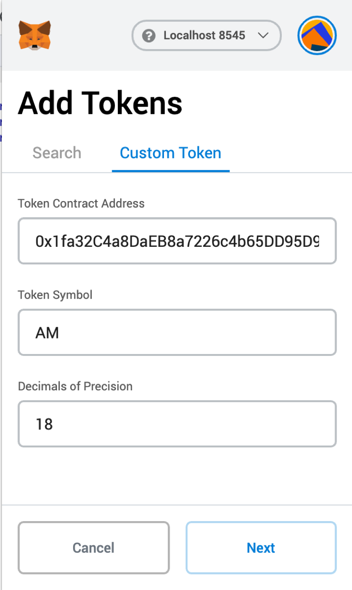
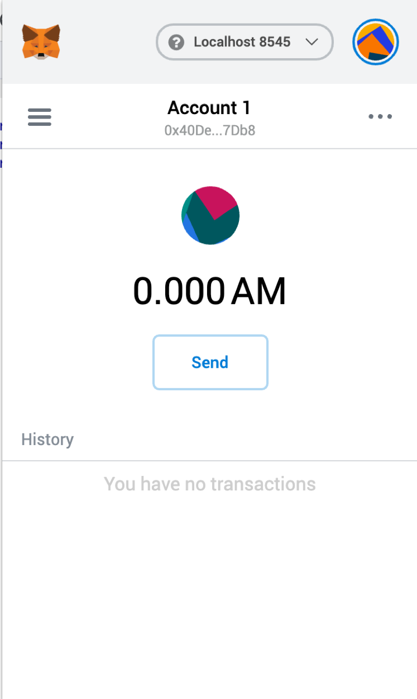
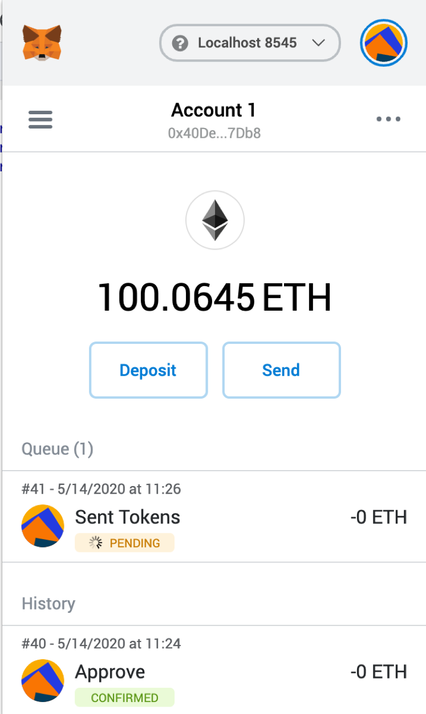
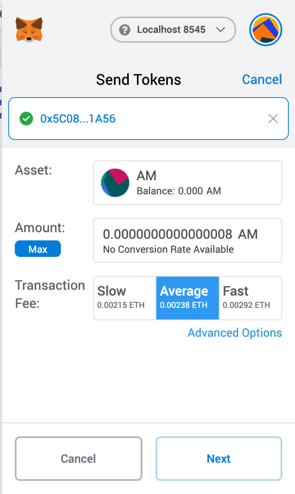
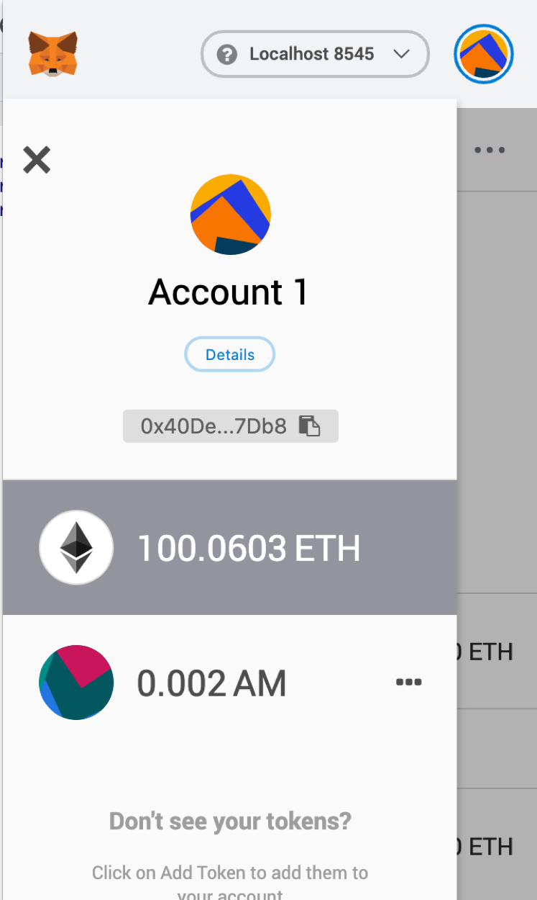
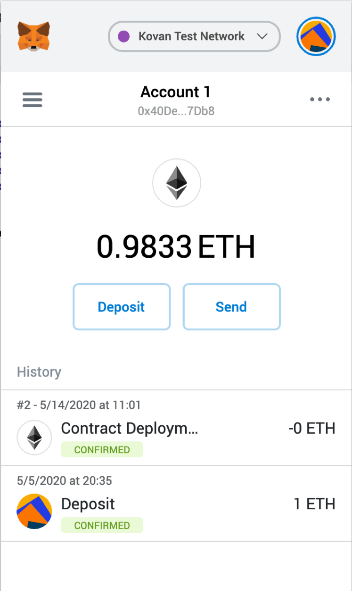
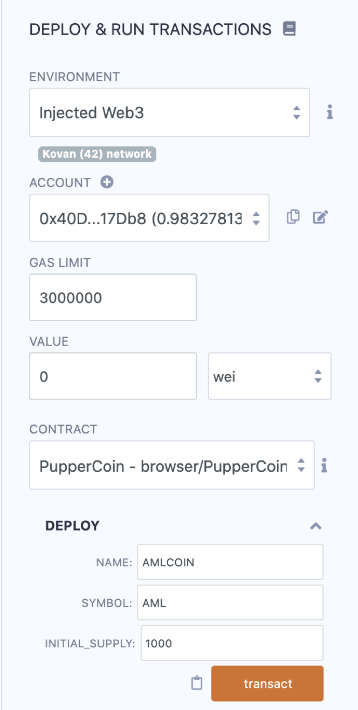
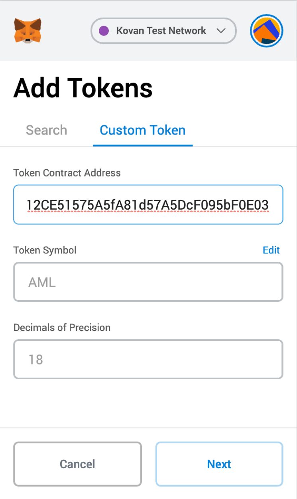
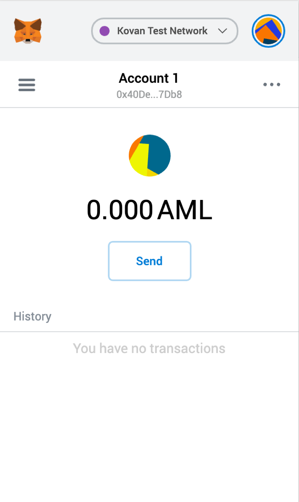
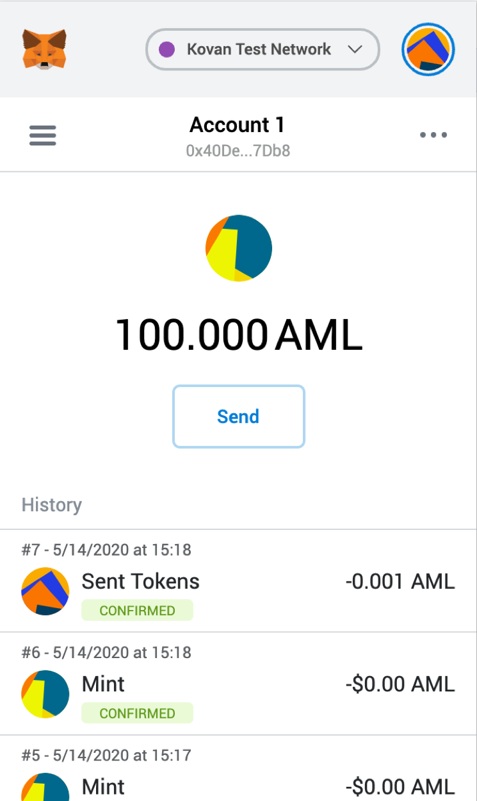

# Unit 21: You sure can attract a crowd!

## Instructions

For this homework, three different Solidity files were coded in Remix (https://remix.ethereum.org/#optimize=false&evmVersion=null&version=soljson-v0.6.6+commit.6c089d02.js).

In the Starter-Code directory you can find the code for each Solidity File:

  1. [PupperCoin.sol](Starter-Code/PupperCoin.sol)
    
  2. [Crowdsale.sol](Starter-Code/Crowdsale.sol)
    
  3. [PupperCoinCrowdsale.sol](Starter-Code/PupperCoinCrowdsale.sol)
  
### Process

The whole process to build and deploy the above code was:

1. Code the file **PupperCoin.sol**

2. Code the file **PupperCoinCrowdsale.sol** leveraging the code from **Crowdsale.sol**

3. Compile and Deploy the above code for **PupperCoinCrowdsale**, initially in LocalHost to check that everything is working fine:

***PupperCoin Contract: 0xA6Aa4dcb9d4Af293D75FF39964fd56a3A7682365***

***PupperCoinSaleDeployer Contact: 0xA216de2248553AA03e16863fB3b41a95fC5A8D64***

***Token Address: 0x0757d0E6CAc376EF405B5806aD5C87aF8F00Dc14***

***Token_sale Address: 0x9aCb5b7Bd63Ae02feF882fB996De61364D3E5256***

4. Add the token created above to a wallet (in MetaMask) and then send some tokens among addresses, checking that transfers are working fine from contract in Remix:

5. Recreate the whole process in Kovan-Testnet network:

***PupperCoin Contract: 0x9980B36a12CE51575A5fA81d57A5DcF095bF0E03***

***PupperCoinSaleDeployer Contact: 0xaeC8297997f697d4D37A28607C61df65167f5654***

***Token Address: 0xbF123b5509306f0812b7E7A0ce7900f4923aBF4F***

***Token_sale Address: 0x57cc0FeC5287f1b87b93FdB8cE8bae5Fd6D9Af6b***

