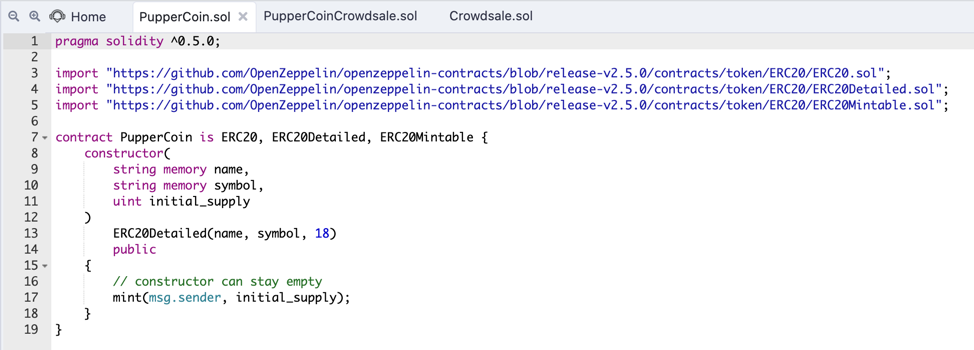
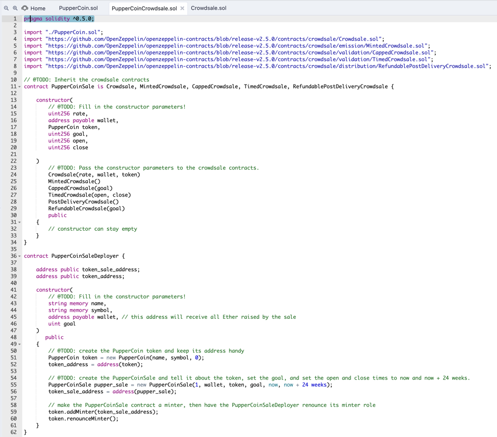
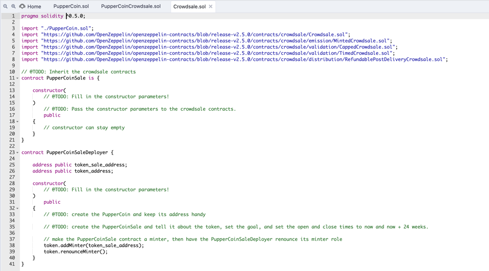
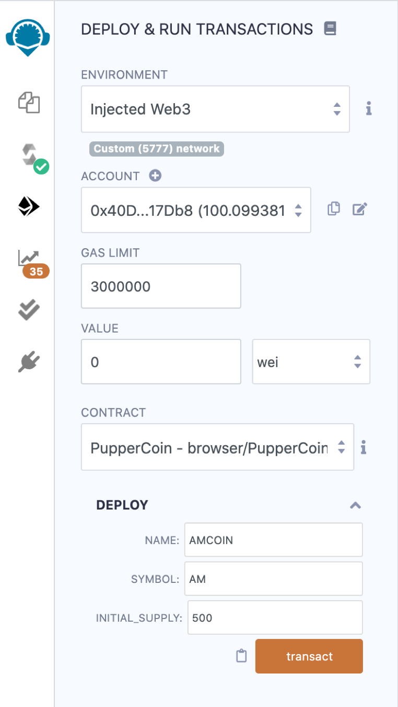
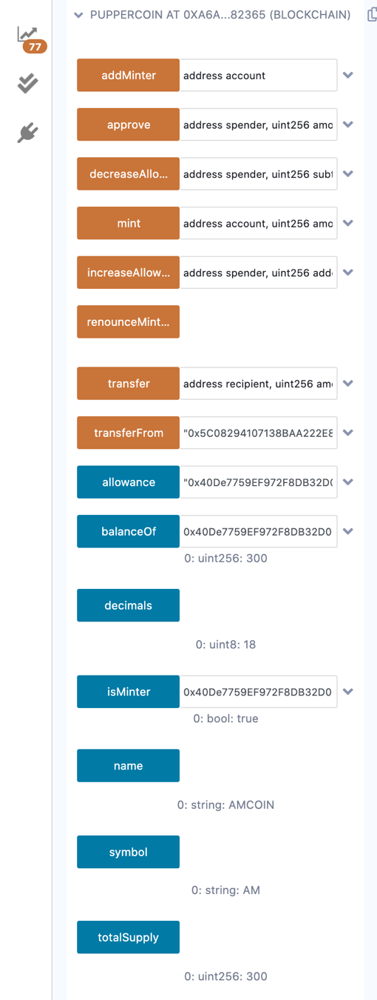
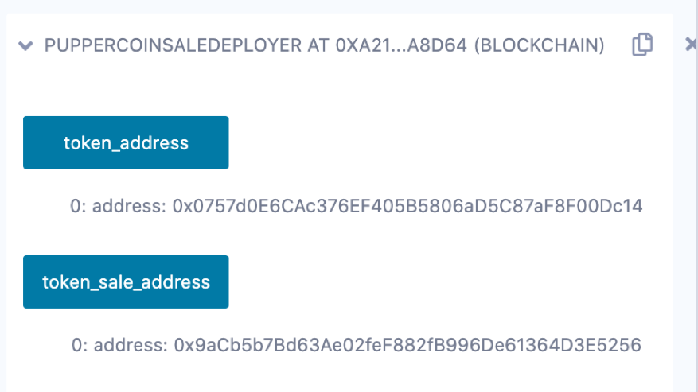

# Unit 21: You sure can attract a crowd!

## Instructions

For this homework, three different Solidity files were coded in Remix (https://remix.ethereum.org/#optimize=false&evmVersion=null&version=soljson-v0.6.6+commit.6c089d02.js).

In the Starter-Code directory you can find the code for each Solidity File:

  1. [PupperCoin.sol](Starter-Code/PupperCoin.sol)
    
  2. [Crowdsale.sol](Starter-Code/Crowdsale.sol)
    
  3. [PupperCoinCrowdsale.sol](Starter-Code/PupperCoinCrowdsale.sol)
  
### Process

The whole process to build and deploy the above code was:

1. Code the file **PupperCoin.sol**

2. Code the file **PupperCoinCrowdsale.sol** leveraging the code from **Crowdsale.sol**

3. Compile and Deploy the above code for **PupperCoinCrowdsale**, initially in LocalHost to check that everything is working fine

